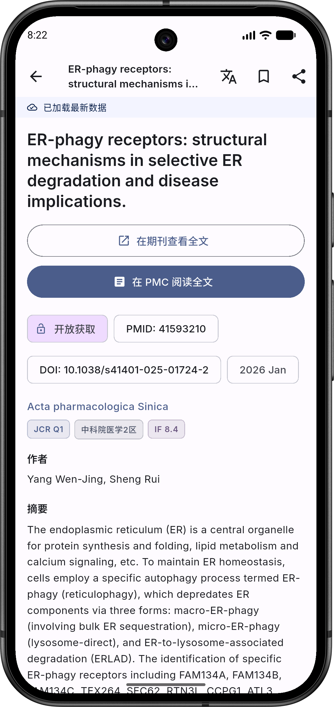
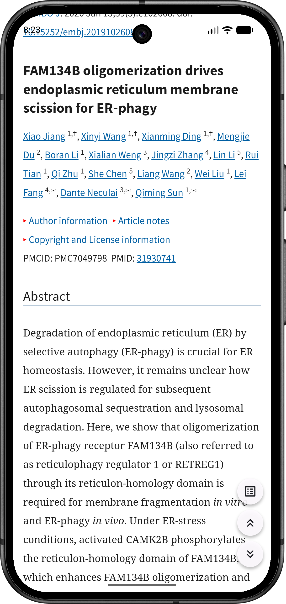
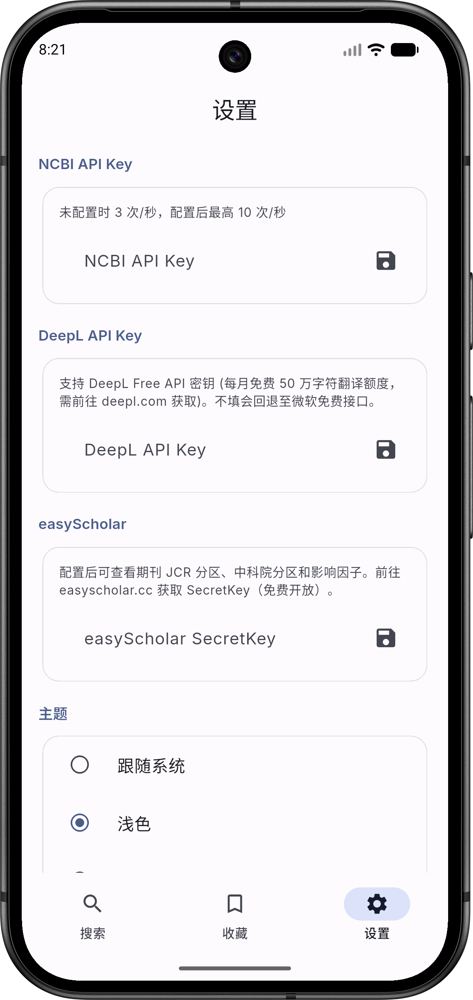
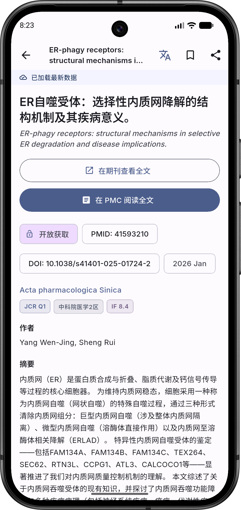
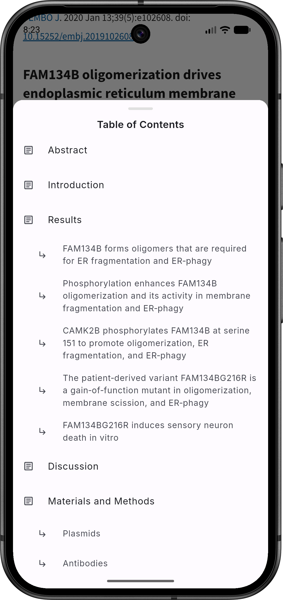

# PubMed (Unofficial Mobile App)

基于 Flutter 的 PubMed 文献检索 Android 生态客户端。支持关键词搜索、文献详情、PMC 开放获取全文阅读、收藏管理，以及离线缓存与多语言互译机制。

> **本项目代码完全由 Claude Opus 4.6 (Anthropic) 生成。**

> [!CAUTION]
> **Disclaimer & Copyright / 免责与版权声明**
>
> This is an **unofficial** third-party application. It is **NOT** affiliated with, endorsed by, or officially connected to the National Center for Biotechnology Information (NCBI), the National Library of Medicine (NLM), or the United States Government.
>
> **Trademark Notice**: All "PubMed" names and associated logos appearing in this app are the intellectual property of NLM or their respective trademark holders. They are used here solely for descriptive, educational and fair-use purposes.
>
> **Medical Disclaimer**: This app does **NOT** provide medical advice, diagnosis, or treatment. The literature information displayed is sourced from public E-utilities APIs. Always consult qualified healthcare professionals for medical decisions.
>
> 本应用为**非官方**第三方开源工具，与 NCBI、NLM 及美国联邦政府**无任何关联**。
>
> **商标声明**：应用中涉及的所有 "PubMed" 名称、标识符及其相关知识产权均归属于国家医学图书馆 (NLM) 或相应的商标持有者。本应用中对其的引用仅限合法、合理使用和描述说明用途。
>
> **医疗免责**：本应用**不提供**任何医疗建议、诊断或治疗方案。所展示的文献数据均由官方开放 API 提供。任何医疗决策前请务必咨询专业医疗人员。

## 目录

- [截图](#截图)
- [技术栈](#技术栈)
- [如何获取与编译代码](#如何获取与编译代码)
- [维护与升级指南](#维护与升级指南)
- [应用命名与版本号说明](#应用命名与版本号说明)
- [项目结构](#项目结构)
- [架构设计](#架构设计)
- [核心模块详解](#核心模块详解)
- [功能模块详解](#功能模块详解)
- [数据流](#数据流)
- [NCBI API 集成](#ncbi-api-集成)
- [代码生成](#代码生成)
- [常见问题](#常见问题)

---

## 截图

主要页面与核心能力预览（示例数据，界面可能随版本迭代微调）。

| 搜索页 | 文献详情页 | PMC 阅读页 |
|---|---|---|
| 关键词检索入口与历史搜索 | 元信息/分区/收藏/分享一体化展示 | WebView 全文阅读、目录与快捷滚动 |
|  |  |  |

| 设置页 | 翻译视图 | TOC 目录抽屉 |
|---|---|---|
| API Key、主题、语言、缓存管理 | 标题/摘要中英切换（带缓存） | 一键跳转到章节，提升长文阅读效率 |
|  |  |  |

## 技术栈

| 类别 | 技术 | 说明 |
|---|---|---|
| 框架 | Flutter (stable) | 跨平台 UI 框架，当前仅启用 Android 平台 |
| 语言 | Dart 3.11+ | 空安全、模式匹配、sealed class |
| 设计系统 | Material 3 + Dynamic Color | Google 最新设计规范，Android 12+ 自动适配壁纸配色 |
| 状态管理 | flutter_riverpod | 编译时安全的响应式状态管理 |
| 网络请求 | Dio | HTTP 客户端，支持拦截器/取消/超时 |
| 数据模型 | freezed + json_serializable | 不可变数据类，自动生成 == / hashCode / copyWith |
| 本地数据库 | Drift (SQLite) | 类型安全的 SQL 数据库 ORM |
| 键值存储 | shared_preferences | 存储用户设置（API Key、主题、语言） |
| WebView | flutter_inappwebview | 内嵌浏览器，用于 PMC 全文阅读 |
| 路由 | go_router | 声明式路由，支持嵌套路由和 ShellRoute |
| 国际化 | 手写 AppLocalizations | 简体中文 + English，约 80 条翻译 |
| XML 解析 | xml | 解析 PubMed EFetch 返回的 XML 格式文献详情 |
| 本地化翻译服务 | Microsoft Translate / DeepL | 详情页提供标题摘要的中英互译支持，支持翻译/原文一键切换，带数据库级缓存 |
| easyScholar 期刊分区查询 | easyScholar API | 配置密钥后自动展示 JCR 分区、中科院分区、SCI 影响因子 |
| 动态取色 | dynamic_color | Android 12+ 根据壁纸自动生成主题配色（并提供了开/关选项） |
| 原生集成 | flutter_native_splash & flutter_launcher_icons | 无缝开屏动画与自适应 PubMed 客户端图标 |
| 字体 | google_fonts (Inter) | 现代无衬线字体 |
| 加载动画 | shimmer | 骨架屏加载占位效果 |

## 如何获取与编译代码

完整的源码包含了 Flutter UI 框架和各项必要的业务逻辑代码，你需要以下环境来编译整个应用：

### 1. 环境准备

- **电脑系统**：Mac, Windows, 或 Linux，安装并配置好 Git。
- **Flutter SDK**: 建议处于 `stable` channel，版本需 `>=3.11.0`。
- **Android 开发环境**: 安装 Android Studio，配置好 Android SDK (compileSdk 36, minSdk 29/Android 10+)。建议同时创建一个基于 API 34 或更高版本的虚拟机用于调试。
- **Java**: JDK 17（推荐由 Android Studio 内置的 Gradle 自动管理）。

### 2. 获取代码与依赖

将此仓库克隆至你的本地任意开发目录：

```bash
git clone https://github.com/aoaim/pubmed-mobile.git
cd pubmed-mobile
```

下载并构建所需的 pub packages：

```bash
# 下载 pubspec.yaml 中定义的所有第三方依赖包 (如 Riverpod, Dio, Drift 等)
flutter pub get

# 执行代码生成：生成数据库中间实体类以及 freezed 不可变数据模型等（必须执行，以解决语法报错）
dart run build_runner build --delete-conflicting-outputs
```

### 3. 本地调试与运行

如果你已经连接了真机设备或开启了 Android 虚拟模拟器（可通过 `flutter devices` 枚举或 `flutter emulators` 拉起），可以直接开始 Debug 模式快速测试：

```bash
flutter run
```

### 4. 首次拿到仓库建议按这个顺序操作（新手友好）

如果你不熟悉 Android/Flutter，可以直接按下面流程走，一般不会踩坑：

```bash
# 1) 拉代码
git clone https://github.com/aoaim/pubmed-mobile.git
cd pubmed-mobile

# 2) 检查环境是否就绪（看是否有红字）
flutter doctor

# 3) 拉依赖
flutter pub get

# 4) 生成代码（首次必跑）
dart run build_runner build --delete-conflicting-outputs

# 5) 连接模拟器/真机后运行
flutter run
```

若遇到构建缓存异常（例如 depfile 报错），可以清理后重建：

```bash
flutter clean
flutter pub get
dart run build_runner build --delete-conflicting-outputs
flutter run
```

### 5. 发布与获取编译产物

当你对代码满意并且想要在物理手机上正式安装或分发应用时，需要构架 Release 版本：

```bash
# 专为现代手机系统生成单体极简纯净安装包（仅包含 arm64-v8a 指令集，排除冗余架构体系）
flutter build apk --release --target-platform=android-arm64
```

**编译产物存放在哪里？**
上述 Build 过程完成后，具有标准命名（含应用名与精准版本号，如 `app-release.apk`）的最终可安装压缩瘦身版 APK 会保存在此原生产出目录下：
👉 `build/app/outputs/flutter-apk/app-release.apk` 

#### 作为维护者如何发布新版本到 GitHub Release
如果你想让普通用户也能下载到你编译出的安装包，请遵循以下分发流程：
1. 确保将 `pubspec.yaml` 中的 `version` 字段递增（例如从 `1.0.0+1` 改为 `1.0.1+2`）。
2. 执行上述发布版构建命令 `flutter build apk --release --target-platform=android-arm64`。
3. 前往本 GitHub 仓库主页右侧，点击 **Releases** 区域的 **Draft a new release**。
4. 创建一个新的 Tag（与版本号对应，如 `v1.0.1`），填写这次更新的说明。
5. 将上一步产生在 `build/app/outputs/flutter-apk/app-release.apk` 的文件拖拽上传到界面底部的附件区域中，重命名为一个好记的名字，比如 `PubMedMobile-v1.0.1-arm64.apk`。
6. 点击 **Publish release**，所有人即可公开下载。

## 维护与升级指南

这一节面向后续维护者（包括不了解 Android 细节的同学），聚焦“怎么安全迭代”。

### 1) 日常维护最小流程

```bash
# 拉取最新代码
git pull

# 更新依赖并验证
flutter pub get
dart run build_runner build --delete-conflicting-outputs
flutter analyze
flutter test
```

建议每次改动后至少做两件事：
- 跑 `flutter analyze`（快速发现静态问题）
- 在模拟器上手测关键链路：搜索 -> 详情 -> PMC 阅读 -> 设置

### 2) 修改数据库或 freezed 模型后的必做动作

- 改了 `lib/core/database/app_database.dart` 的表结构：
  1. 更新 `schemaVersion`
  2. 在 `migration` 中补升级逻辑
  3. 重新跑 `build_runner`
- 改了 `@freezed` 数据类字段：必须重跑 `build_runner`

命令：

```bash
dart run build_runner build --delete-conflicting-outputs
```

### 3) 升级版本号的建议规则

- 补丁修复（仅修 bug）：`0.1.0 -> 0.1.1`
- 小功能新增（兼容旧行为）：`0.1.x -> 0.2.0`
- 大改或不兼容变更：`0.x -> 1.0.0`（或主版本 +1）

当前项目 `pubspec.yaml` 采用：

```yaml
version: 0.1.0
```

> 说明：不写 `+buildNumber` 时，Android 侧通常按默认构建号处理。若你计划长期发布，建议恢复为 `x.y.z+N` 以便精确追踪安装包迭代。

### 4) 发布前检查清单（建议照抄执行）

```bash
flutter clean
flutter pub get
dart run build_runner build --delete-conflicting-outputs
flutter analyze
flutter test
flutter build apk --release --target-platform=android-arm64
```

并人工检查：
- 应用名显示是否正确（`PubMed`）
- 设置页版本文案是否与 `pubspec.yaml` 一致
- PMC 全文缓存是否可写入、二次打开是否正常
- README 是否同步更新了新增/变更功能

## 应用命名与版本号说明

这一节专门解释「包名」「显示名」「版本号」三个常被混淆的概念，便于后续维护时不误改。

### 1) `pubspec.yaml` 的 `name` 是否应该是 `pubmed_mobile`

是正确的，建议保持为：

```yaml
name: pubmed_mobile
description: "A mobile PubMed literature search client."
publish_to: 'none'
version: 0.1.0
```

原因：
- `name` 是 **Dart/Flutter 包标识符**，要求使用小写 + 下划线（snake_case）。
- 它不是手机桌面图标显示名称，也不是 Android 设置里的应用标题。
- 改成 `PubMed`（含大写）会违反 Dart 包命名规范，并可能影响构建、依赖解析与工具链行为。

### 2) 你看到的应用名称来自哪里

当前项目中，不同层的命名来源如下：

| 层级 | 当前值 | 作用 | 修改位置 |
|---|---|---|---|
| Dart 包名 | `pubmed_mobile` | 代码包与工具链标识 | `pubspec.yaml` 的 `name` |
| Android 桌面显示名 | `PubMed` | 启动器图标下显示的名称 | `android/app/src/main/AndroidManifest.xml` 的 `android:label` |
| Android 包名（applicationId） | `dev.aoaim.pubmed_mobile` | 安装包唯一标识（影响升级/签名/商店） | `android/app/build.gradle.kts` 的 `applicationId` |
| Flutter 应用标题 | `PubMed Mobile` | 系统任务视图/语义标题等 | `lib/main.dart` 的 `MaterialApp.router(title: ...)` |

### 3) `version: 0.1.0` 是否正确

语义上完全正确，且符合 Flutter 约定：
- `0.1.0` = 用户可见版本号（Android 的 `versionName`）
- 当前未显式填写 `+buildNumber`，可按需要后续补充为 `0.1.0+N`

当前 `android/app/build.gradle.kts` 使用 `flutter.versionName` 和 `flutter.versionCode`，所以这里会自动同步到 Android 构建。

> 维护提醒：设置页「关于」里有一处文案写死了 `0.1.0`（不是自动读取 pubspec）。版本升级时请同步更新该文案，避免展示与实际安装包版本不一致。

---

## 项目工程结构

当你拿到完整的代码时，核心逻辑业务全都在 `lib/` 目录下。它的骨架如下划分：

```
lib/
├── main.dart                              # 整个应用的启动入口 (设置依赖树、注入持久化库、装载路由框架)
├── core/                                  # 全局基础设施代码（这里不挂载具体某一个业务场景页面）
│   ├── constants/
│   │   └── app_constants.dart             # 全局常量
│   ├── database/
│   │   ├── app_database.dart              # Drift 数据库定义（表 + DAO 方法）
│   │   └── app_database.g.dart            # [生成] Drift 代码
│   ├── error/
│   │   ├── failures.dart                  # 统一错误类型（freezed）
│   │   └── failures.freezed.dart          # [生成] freezed 代码
│   ├── l10n/
│   │   └── app_localizations.dart         # 中英文翻译
│   ├── network/
│   │   ├── dio_client.dart                # Dio 实例配置 + 拦截器
│   │   └── rate_limiter.dart              # 令牌桶限流器
│   ├── router/
│   │   └── app_router.dart                # GoRouter 路由表
│   ├── theme/
│   │   └── app_theme.dart                 # Material 3 主题（亮/暗）
│   └── widgets/
│       └── app_shell.dart                 # 底部导航栏外壳
│
└── features/                              # 业务功能模块
    ├── search/                            # 文献搜索
    │   ├── data/
    │   │   ├── datasources/
    │   │   │   └── pubmed_api_datasource.dart   # NCBI E-utilities API 调用
    │   │   └── repositories/
    │   │       └── article_repository.dart       # 业务仓库（API + 缓存桥接）
    │   ├── domain/
    │   │   └── entities/
    │   │       ├── article.dart                  # Article 领域实体
    │   │       └── search_result.dart            # SearchResult 领域实体
    │   └── presentation/
    │       ├── providers/
    │       │   └── search_provider.dart          # 搜索状态管理
    │       ├── screens/
    │       │   └── search_screen.dart            # 搜索页面
    │       └── widgets/
    │           └── article_card.dart             # 文章摘要卡片组件
    ├── article_detail/                    # 文献详情
    │   ├── data/services/
    │   │   ├── translation_service.dart    # 翻译服务（DeepL / Microsoft）
    │   │   └── easyscholar_service.dart    # easyScholar 期刊分区查询
    │   └── presentation/screens/
    │       └── article_detail_screen.dart  # 详情页面（摘要、MeSH、期刊分区、收藏、分享）
    ├── reader/                            # PMC 全文阅读器
    │   └── presentation/screens/
    │       └── reader_screen.dart          # WebView 阅读页面
    ├── favorites/                         # 收藏管理
    │   └── presentation/screens/
    │       └── favorites_screen.dart       # 收藏列表页面
    └── settings/                          # 用户设置
        ├── data/
        │   └── settings_repository.dart    # SharedPreferences 读写封装
        └── presentation/screens/
            └── settings_screen.dart        # 设置页面
```

> **命名约定**：`*.g.dart` = Drift 代码生成产物；`*.freezed.dart` = freezed 代码生成产物。这些文件由 `build_runner` 自动生成，**不要手动编辑**。

---

## 架构设计

采用 **Clean Architecture** 分层，每个 feature 模块内部分为三层：

```
┌─────────────────────────────────────────────┐
│  Presentation (UI)                          │
│  Screen → Widget → Provider (Riverpod)      │
├─────────────────────────────────────────────┤
│  Domain (业务逻辑)                           │
│  Entity (不可变数据模型)                       │
├─────────────────────────────────────────────┤
│  Data (数据获取)                             │
│  Repository → DataSource (API / DB)         │
└─────────────────────────────────────────────┘
```

**依赖方向**：上层依赖下层，下层不知道上层的存在。

**状态管理**：使用 Riverpod 的 `StateNotifier` + `Provider`。所有 Provider 定义在各自模块中，通过 `ref.watch()` 实现响应式数据流。

---

## 核心模块详解

### `main.dart` — 应用入口

- 初始化 `SharedPreferences`（异步，必须在 `runApp` 前完成）
- 创建 `ProviderScope`，注入 `SharedPreferences` 实例
- 构建 `MaterialApp.router`，绑定主题、路由、国际化

### `core/constants/app_constants.dart` — 全局常量

| 常量 | 值 | 用途 |
|---|---|---|
| `ncbiBaseUrl` | `https://eutils.ncbi.nlm.nih.gov/entrez/eutils/` | NCBI API 基础 URL |
| `toolName` | `pubmed_mobile` | NCBI 要求的 tool 参数 |
| `rateLimitWithoutKey` | 3 | 无 API Key 时每秒最大请求数 |
| `rateLimitWithKey` | 10 | 有 API Key 时每秒最大请求数 |
| `defaultPageSize` | 20 | 搜索结果每页条数 |
| `searchCacheDays` | 7 | 搜索结果及历史记录强制缓存期限（自动清理，不受存储上限约束） |
| `detailCacheDays` | 30 | 文献详情强制缓存期限 |
| `maxHistoryItems` | 50 | 搜索历史最大保留条数 |
| `searchDebounceDuration` | 500ms | 搜索输入防抖延迟 |

### `core/database/app_database.dart` — SQLite 数据库

使用 Drift ORM，定义了 **四张表**：

| 表名 | 用途 | 主键 | 过期策略 |
|---|---|---|---|
| `CachedArticles` | API 文献数据（摘要 + 详情） | `pmid` | 搜索结果 7 天 / 详情 30 天自动清理 |
| `Favorites` | 用户收藏 | `pmid` | 永久，用户手动删除 |
| `SearchHistory` | 搜索历史 | `id`（自增） | 7 天自动清理，最多保留 50 条 |
| `PmcFullTextCache` | PMC 全文 HTML | `pmcid` | **永久**，用户点刷新才清除 |

**三类缓存策略对比**：

| 数据类型 | 首次加载 | 再次打开 | 何时更新 |
|---|---|---|---|
| 搜索结果 | 联网拉取 API | 7 天内读缓存，过期重拉 | 自动（7 天到期） |
| 文献详情 | 联网拉取 API | 30 天内读缓存，过期重拉 | 自动（30 天到期） |
| PMC 全文 HTML | 联网加载页面，加载完存 DB | **直接渲染本地 HTML** | 仅当用户手动点击刷新按钮 |

> PMC 全文不设自动失效期，因为已发表文章正文几乎不变；手动刷新会清除当前文章的 DB 缓存并重新联网。

**关键方法**：
- `upsertCachedArticle()` — 插入或更新缓存（insert on conflict update）
- `clearExpiredCache(Duration)` — 清理超过指定期限的缓存
- `watchFavorites()` — 返回 `Stream<List<Favorite>>`，收藏列表变化时自动通知 UI
- `addHistory()` — 添加搜索历史，自动去重并限制条数
- `upsertPmcHtml(pmcid, html)` — 存储 PMC 全文 HTML
- `getPmcHtml(pmcid)` — 查询已缓存的 PMC 全文
- `deletePmcHtml(pmcid)` — 删除指定文章的全文缓存（刷新时调用）

**注意**：数据库文件存储在 `getApplicationDocumentsDirectory()/pubmed_mobile.sqlite`，使用 `NativeDatabase.createInBackground()` 在后台 Isolate 中运行。

### `core/error/failures.dart` — 统一错误类型

使用 freezed sealed class 定义 6 种错误类型：`NetworkFailure`、`ServerFailure`、`CacheFailure`、`ParseFailure`、`RateLimitedFailure`、`UnknownFailure`。每种都包含 `message` 字段。

### `core/network/dio_client.dart` — 网络客户端

Dio 实例配置，包含 **三个拦截器**（按顺序执行）：

1. **RateLimitInterceptor** — 令牌桶限流，在发送请求前 `await` 等待令牌。无 Key 限 3 req/s，有 Key 限 10 req/s
2. **RetryOn429Interceptor** — 收到 HTTP 429 时，读取 `Retry-After` Header，等待指定秒数后自动重试（最多 3 次）
3. **LogInterceptor** — 仅在 debug 模式下启用，打印请求/响应日志

**API Key 注入**：从 `SettingsRepository` 读取用户配置的 API Key，附加到所有请求的 `api_key` query parameter。每次 API Key 变更后，Dio 实例会通过 Riverpod 自动重建。

### `core/network/rate_limiter.dart` — 令牌桶限流器

经典令牌桶算法实现：
- 桶容量 = `maxPerSecond`
- 按时间流逝匀速补充令牌
- `acquire()` 方法：有令牌立即消耗，无令牌则 `await Future.delayed` 直到有令牌

### `core/router/app_router.dart` — 路由配置

| 路径 | 页面 | 说明 |
|---|---|---|
| `/search` | SearchScreen | 搜索页（默认首页） |
| `/favorites` | FavoritesScreen | 收藏页 |
| `/settings` | SettingsScreen | 设置页 |
| `/article/:pmid` | ArticleDetailScreen | 文献详情（全屏，不含底部导航） |
| `/reader/:pmcid` | ReaderScreen | PMC 全文阅读器（全屏） |

前三个路由包裹在 `ShellRoute` 中，共享底部 `NavigationBar`。后两个是全屏路由。

### `core/theme/app_theme.dart` — Material 3 主题

- Seed color: `#1565C0`（PubMed 蓝）
- 支持 `light()` 和 `dark()` 两个工厂方法
- 可接收外部 `ColorScheme`（为 Dynamic Color 预留）
- 全局统一了 `AppBar`、`Card`、`InputDecoration`、`Chip`、`NavigationBar`、`SnackBar` 的样式
- 字体使用 Google Fonts Inter

### `core/widgets/app_shell.dart` — 底部导航外壳

`ShellRoute` 的 builder widget。包含一个 M3 `NavigationBar`，三个 tab：搜索、收藏、设置。通过读取 `GoRouterState` 当前路径判断选中状态。

### `core/l10n/app_localizations.dart` — 国际化

手写的本地化方案（不依赖 arb 文件/代码生成）：
- 支持 `zh-CN`（简体中文）和 `en-US`（英文）
- 约 80 条翻译字符串，覆盖所有 UI 文本
- 通过 `locale.languageCode == 'zh'` 简单分支实现
- 提供 `LocalizationsDelegate` 集成到 `MaterialApp`

---

## 功能模块详解

### `features/search/` — 文献搜索

这是最核心的模块，包含完整的 data → domain → presentation 三层：

#### `data/datasources/pubmed_api_datasource.dart`

封装 NCBI E-utilities 的四个 API 调用：

| 方法 | API | 输入 → 输出 |
|---|---|---|
| `search()` | ESearch | 关键词 → PMID 列表 + 总数 |
| `fetchSummaries()` | ESummary | PMID 列表 → 文章摘要列表（JSON 解析） |
| `fetchDetail()` | EFetch | 单个 PMID → 完整文章详情（**XML 解析**） |
| `spellCheck()` | ESpell | 关键词 → 拼写纠正建议 |

**XML 解析细节**（`fetchDetail`）：
- 使用 `xml` 包解析 PubMed XML 格式
- 提取节点：`ArticleTitle`、`Author`（LastName + ForeName）、`Journal/Title`、`PubDate`（Year + Month）、`AbstractText`（支持结构化摘要，保留 Label）、`ArticleId`（DOI 和 PMC ID）、`MeshHeading/DescriptorName`

#### `data/repositories/article_repository.dart`

桥接 API 和本地缓存的业务仓库：

- **`searchArticles()`**：调用 ESearch → ESummary，将结果缓存到 `CachedArticles` 表，同时记录搜索历史
- **`getArticleDetail()`**：先查缓存（30 天内且有完整详情），命中则直接返回；否则调用 EFetch 获取并缓存
- **`spellCheck()`**：透传 ESpell 结果
- 缓存序列化：`authors` 和 `meshTerms` 以 JSON 字符串存储在 SQLite text 字段中

#### `domain/entities/article.dart`

freezed 不可变实体。关键字段：`pmid`、`title`、`authors`（List<String>）、`journal`、`pubDate`、`doi`、`pmcid`、`abstract_`、`meshTerms`、`hasFullDetail`。

扩展方法：`hasFullText`（是否有 PMC 全文）、`pmcUrl`、`pubmedUrl`、`doiUrl`。

#### `presentation/providers/search_provider.dart`

`SearchNotifier` (StateNotifier) 管理搜索状态：

- **手动搜索**：`search()` 由搜索按钮或键盘提交触发，不再自动搜索
- **搜索缓存**：内存级 stale-while-revalidate 策略，同一关键词再次搜索时先展示缓存结果，同时后台拉取最新数据刷新
- **无限滚动**：`loadMore()` 加载下一页，拼接到现有列表
- **排序切换**：`setSort()` 切换 relevance/date 并重新搜索
- **拼写建议**：搜索完成后在后台异步调用 ESpell

状态类 `SearchState` 包含：query、articles、totalCount、currentPage、isLoading、isLoadingMore、error、spellingSuggestion、sort。

#### `presentation/screens/search_screen.dart`

搜索页面 UI，包含：
- **搜索按钮**：需点击搜索图标或键盘提交才触发搜索（不自动搜索）
  - **M3 SearchBar**：带动态清除按钮，并且首次搜索带有平滑过渡动画
  - **搜索结果缓存**：再次搜索相同词时先展示缓存，再刷新
  - **排序切换**：SegmentedButton（相关性/日期）
  - **拼写建议**：可点击替换搜索词
  - **结果列表**：ListView.builder + 无限滚动（底部 500px 触发预加载，每次加载条数可配置）
  - **骨架屏**：内置卡片级 shimmer 闪烁遮罩，优化单调加载体验，无闪烁突变感
  - **过渡动画**：精简搜索状态与内容切换的 `AnimatedSwitcher` 时长（由 300ms 缩减至 100~150ms），拒绝拖沓，界面响应更干脆
- **搜索历史**：无搜索词时显示，支持单条删除和全部清除
- **空状态**：无结果提示

#### `presentation/widgets/article_card.dart`

文章摘要卡片，显示：标题（最多 3 行）、前 3 位作者 + "et al."、期刊名（primary 色）、发表日期、PMC/DOI 标签。

### `features/article_detail/` — 文献详情

#### `presentation/screens/article_detail_screen.dart`

- **SliverAppBar.large**：可折叠标题
- **PMC 全文按钮**：有 PMC ID 时显示，点击跳转 WebView 阅读器
- **Meta 信息**：Chip 展示 PMID、DOI（可点击复制）、发表日期、Open Access 标签
- **作者列表**：完整展示
- **摘要**：SelectableText，支持长按选择复制
- **自动翻译与切换**：一键翻译外文标题和摘要到中文或英文，可在翻译/原文间自由切换，并落盘缓存
- **期刊分区**（easyScholar）：配置 SecretKey 后自动展示 JCR 分区、中科院分区、SCI 影响因子等
- **MeSH 关键词**：Chip 列表
- **收藏按钮**：AppBar action，实时切换图标状态
- **复制标题**：AppBar 一键复制论文标题到系统剪切板
- **分享按钮**：分享标题 + PubMed URL

使用 `FutureProvider.family` 按 PMID 异步加载详情数据。

### `features/reader/` — PMC 全文阅读器

#### `presentation/screens/reader_screen.dart`

- 使用 `flutter_inappwebview` 加载 PMC 全文，地址为 `https://www.ncbi.nlm.nih.gov/pmc/articles/{pmcid}/`
- **全文 HTML 缓存**：
  - 首次打开联网加载，加载完成后将 `document.documentElement.outerHTML` 存入 `PmcFullTextCache` 表
  - 再次打开时直接从 SQLite 读取 HTML，通过 `loadData(baseUrl: ncbi.nlm.nih.gov)` 渲染，无需联网
  - 点击刷新按钮清除当前文章的 DB 缓存，强制重新联网加载
  - 无自动过期：已发表文章正文基本不变，只有用户主动刷新才会更新
- **缓存读取稳定性（白屏修复点）**：
  - 本地缓存通过 `initialData` 注入 WebView 时，主文档 URL 可能是 `about:` / `data:` / `file:` / `blob:` 方案。
  - 如果在 `shouldOverrideUrlLoading` 中一刀切拦截非 `ncbi.nlm.nih.gov` 域名，会把这些本地文档也拦截，导致「第二次打开白屏」。
  - 当前实现已显式放行上述本地 scheme，网络层继续限制非 NIH/NCBI 外链；并通过前端注入拦截页面内链接点击，避免误触跳转打断阅读。
- **沉浸模式**（可在设置中开关）：JS 注入裁剪页面，只保留 `.pmc-article-section` 主内容，隐藏 header / footer / sidebar / 声明框
- **自动隐藏 AppBar**：向下滚动超过 80px 时 AppBar 折叠隐藏，向上滑动时防抖恢复显示（通过透明叠层与 `AnimatedContainer` 真正释放受屏幕空间，并完美解决系统底部小白条与顶部状态栏对网页内容的遮挡问题）
- **三个浮动按钮**（沉浸模式下显示）：
  - **TOC**（目录）：提取文章 `h2` 节标题（Abstract、Introduction、Methods…），底部抽屉展示，点击平滑滚动到对应章节
  - **滚到顶部** / **滚到底部**：右下角快速跳转
- **进度条**：AppBar 底部 LinearProgressIndicator
- **错误处理**：加载失败显示重试页面
- **URL 过滤**：`shouldOverrideUrlLoading` 允许 NIH/NCBI 域名并拦截外部域名；同时注入 JS 禁用页面内 `<a>` 点击，保证沉浸阅读

### `features/favorites/` — 收藏管理

#### `presentation/screens/favorites_screen.dart`

- 使用 `StreamProvider` 监听 `watchFavorites()`，收藏变化实时更新 UI
- **Dismissible** 滑动删除
- **批量导出**：顶部 AppBar 提供专属动作将当前收藏的文献（包含标题、PMID 和 DOI）快速输出到系统剪切板。
- PMC 标记：有全文的文章右侧显示图标
- 点击跳转文献详情

### `features/settings/` — 用户设置

#### `data/settings_repository.dart`

SharedPreferences 的类型安全封装：

| 设置项 | SharedPreferences Key | 默认值 |
|---|---|---|
| NCBI API Key | `ncbi_api_key` | null（不使用） |
| DeepL API Key | `deepl_api_key` | null（降级到 Microsoft Edge API） |
| easyScholar Key | `easyscholar_key` | null（不展示期刊分区） |
| 主题模式 | `theme_mode` | system |
| 动态取色开关 | `use_dynamic_color` | true (Android 12+) |
| 加载条数 | `page_size` | 20 (支持 10/20/50/100) |
| 语言 | `locale` | zh（简体中文） |
| 缓存上限 | `max_cache_mb` | 200 MB |

还提供了相应的 StateNotifier：`ThemeModeNotifier`、`UseDynamicColorNotifier`、`PageSizeNotifier`、`LocaleNotifier` 等，修改设置时同时持久化到 SharedPreferences 且实时更新 UI。

#### `presentation/screens/settings_screen.dart`

- **API Key**：分别提供 NCBI API、DeepL 翻译 API、easyScholar 期刊分区 API 的配置项
- **easyScholar**：配置 SecretKey 后，文献详情页会自动查询并展示期刊 JCR 分区、中科院分区和影响因子
- **主题**：
  - 模式三选一：跟随系统/浅色/深色。
  - 动态取色开关：开启后会在 Android 12+ 设备上自动抓取壁纸配色 (Material You)。如果关闭或设备不支持，将回退使用应用内置的 PubMed 经典蓝作为 Seed Color。
- **每次加载条数**：允许用户设置单次 API 请求和分页加载返回的文献数量 (10/20/50/100)。
- **语言**：两选一（简体中文/English (UK)）
- **缓存管理**：
  - 显示当前数据库已占用条数并提供一键清除按钮。
  - **过期策略**：搜索列表相关的本地缓存与搜索历史**强行保留 7 天**，超期自动清理，不受容量上限设置的约束。
- **关于**：包含版本号、GitHub 开源代码仓库链接及致谢

---

## 数据流

### 搜索流程（完整链路）

```
用户输入关键词
    ↓ (500ms 防抖)
SearchNotifier.search()
    ↓
ArticleRepository.searchArticles()
    ├── PubmedApiDataSource.search()        → ESearch API → PMID 列表
    ├── PubmedApiDataSource.fetchSummaries() → ESummary API → 文章摘要
    ├── AppDatabase.upsertCachedArticle()    → 缓存到 SQLite
    └── AppDatabase.addHistory()            → 记录搜索历史
    ↓
SearchState 更新 → UI 重建 → 显示结果列表
```

### 详情查看流程

```
用户点击文章卡片
    ↓
GoRouter → /article/:pmid
    ↓
ArticleDetailScreen → articleDetailProvider(pmid)
    ↓
ArticleRepository.getArticleDetail()
    ├── 检查 SQLite 缓存（30 天内 + hasFullDetail）
    │   ├── 命中 → 直接返回
    │   └── 未命中 ↓
    ├── PubmedApiDataSource.fetchDetail()  → EFetch API → XML 解析
    └── AppDatabase.upsertCachedArticle()  → 更新缓存
```

---

## NCBI API 集成

### E-utilities 端点

| 端点 | 格式 | 用途 |
|---|---|---|
| `esearch.fcgi` | JSON | 关键词搜索 → PMID 列表 |
| `esummary.fcgi` | JSON | PMID → 文章摘要（标题、作者、期刊等） |
| `efetch.fcgi` | **XML** | PMID → 完整记录（摘要全文、MeSH 等） |
| `espell.fcgi` | JSON | 拼写检查 |

### 速率限制

NCBI 对 E-utilities 有严格的速率限制：
- **无 API Key**：3 requests/second
- **有 API Key**：10 requests/second

本项目通过两层机制应对：
1. **令牌桶**（`RateLimiter`）：请求发出前主动限流
2. **429 重试**（`RetryOn429Interceptor`）：收到 429 后读取 `Retry-After` 并等待重试

### 获取 API Key

免费注册：https://www.ncbi.nlm.nih.gov/account/settings/ → 创建 API Key → 在 App 设置页填入。

---

## 代码生成

本项目使用 `build_runner` 生成以下代码：

| 生成器 | 源文件 | 产物 | 作用 |
|---|---|---|---|
| freezed | `*.dart` (含 `@freezed`) | `*.freezed.dart` | 不可变类 copyWith/==/ hashCode |
| drift_dev | `app_database.dart` | `app_database.g.dart` | 数据库 SQL 映射代码 |

**修改 freezed 实体或数据库表结构后，必须重新运行**：

```bash
dart run build_runner build --delete-conflicting-outputs
```

---

## 常见问题

### Q: 搜索报错 "Failed to load dynamic library libsqlite3.so"
**A**: `sqlite3_flutter_libs` 的版本必须锁定在 `>=0.5.0 <0.6.0`。`0.6.0+eol` 是空壳包不包含 native library。检查 `pubspec.yaml` 中的版本约束。

### Q: 搜索报错 429 Too Many Requests
**A**: 无 API Key 时 NCBI 限制 3 req/s。项目已内置 429 自动重试，但高频搜索仍可能触发。建议在设置页配置 API Key。

### Q: 修改了 Article 实体字段后编译报错
**A**: freezed 实体需要重新生成代码：`dart run build_runner build --delete-conflicting-outputs`。

### Q: 修改了数据库表结构后怎么办
**A**: 1) 重跑 `build_runner`；2) 递增 `schemaVersion`；3) 在 `AppDatabase` 中添加 migration 逻辑。开发阶段可卸载 App 重装。

### Q: 如何添加新的 feature 模块
**A**: 在 `lib/features/` 下创建新目录，按 `data/` → `domain/` → `presentation/` 三层组织。在 `app_router.dart` 中添加路由。

### Q: Debug APK 为什么 160+ MB
**A**: Debug 包含 JIT 编译器和调试信息。Release 构建约 15-25 MB：`flutter build apk --release --split-per-abi`。

### Q: PMC 全文第一次能打开，第二次打开白屏
**A**: 先检查 `reader_screen.dart` 的 `shouldOverrideUrlLoading`。如果未放行 `about:`、`data:`、`file:`、`blob:`，缓存 HTML 会被拦截并白屏。当前代码已修复：本地 scheme 放行，网络层拦截外部域名，页面内链接点击由 JS 统一禁用。

---

## 许可证

本项目采用 [MIT License](LICENSE) 开源。
## API 速率与翻译说明

本应用直接请求 NCBI 的开放 API。为了不被封禁，内置了如下速率限制与建议：
- **公共请求 (未配置 Key):** 限制最高并发速率为 `3 次/秒`。如果超过系统会自动排队与重试，大量搜索或加载详情时速度可能较慢。
- **配置 NCBI API Key 后:** 速率上限会提高到 `10 次/秒`，显著提升数据获取体验。
  - 获取方法：注册 NCBI/PubMed 账号，进入 Account Settings 创建并获取 API Key。

**翻译功能**
一键翻译文献标题与摘要的功能默认使用 Microsoft Edge API（无需 Key 免费请求）。同时支持配置 DeepL 提升翻译质量（采用 `prefer_quality_optimized` 最新大模型模式）。
- **DeepL API Key (Free API):** 
  - 前往 [DeepL API 开发者官网](https://www.deepl.com/pro-api) 注册 Free 账号获得
  - 每月可免费享受 **500,000 字符**的翻译额度
  - 获取后配置到设置里，应用会自动检测中英文进行翻译
  - 备注：填入带有 `:fx` 为结尾的 Free Api Key，应用会自动使用对应的免费接入端点

**easyScholar 期刊分区查询**
配置 easyScholar SecretKey 后，进入文献详情页时会自动查询并展示该期刊的学术评级信息。
- **查询展示内容**：JCR SCI 分区、中科院升级版分区、SCI 影响因子、五年影响因子、Top 分区标识等
- **SecretKey 获取**：前往 [easyScholar 官网](https://www.easyscholar.cc) 注册账号，在个人中心获取 SecretKey（免费开放）
- **速率限制**：该接口限制 2 次/秒，应用内置内存缓存避免重复请求
