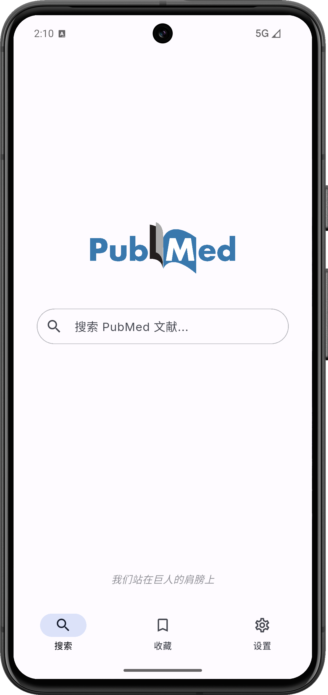
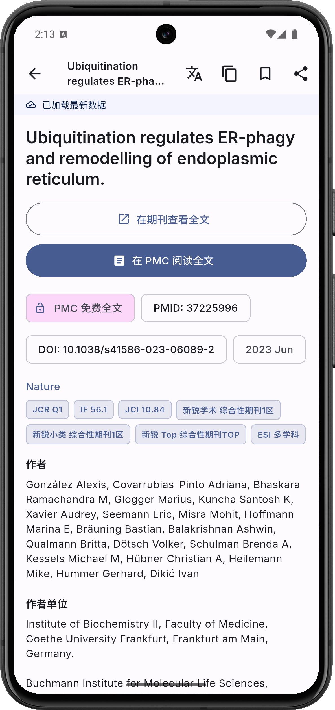
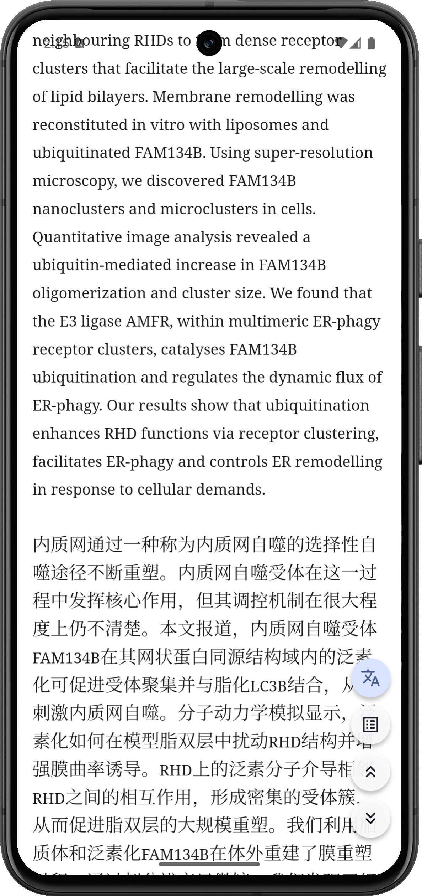
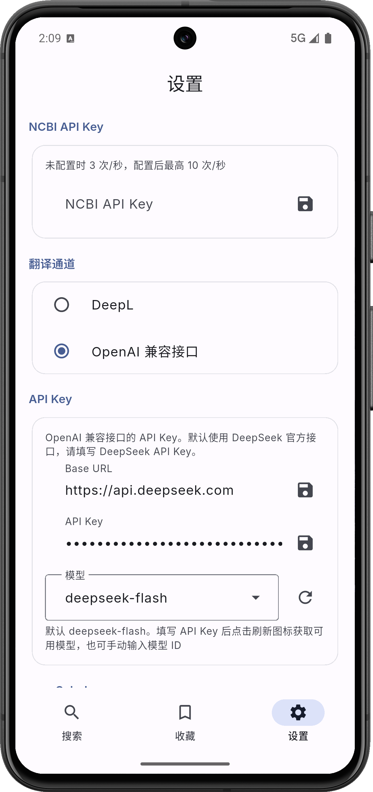
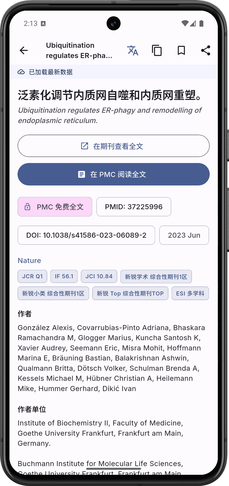
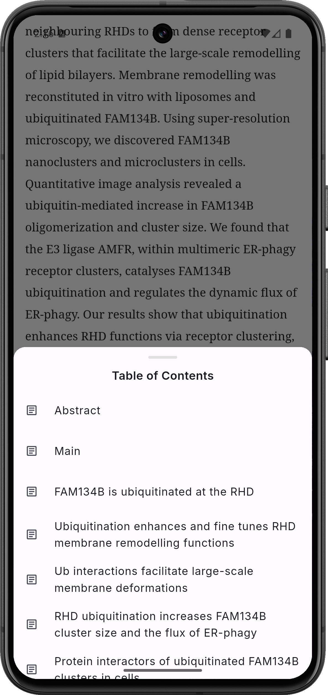

# PubMed (Unofficial Mobile App)

基于 Flutter 的 PubMed 文献检索 Android 生态客户端。支持关键词搜索、文献详情、PMC 免费全文阅读、收藏管理，以及离线缓存与多语言互译机制。

> **本项目由 AI 辅助开发**

> [!CAUTION]
> **Disclaimer & Copyright / 免责与版权声明**
>
> This is an **unofficial** third-party application. It is **NOT** affiliated with, endorsed by, or officially connected to the National Center for Biotechnology Information (NCBI), the National Library of Medicine (NLM), or the United States Government.
>
> **Trademark Notice**: All "PubMed" names and associated logos appearing in this app are the intellectual property of NLM or their respective trademark holders. They are used here solely for descriptive, educational and fair-use purposes.
>
> **Medical Disclaimer**: This app does **NOT** provide medical advice, diagnosis, or treatment. The literature information displayed is sourced from public E-utilities APIs. Always consult qualified healthcare professionals for medical decisions.
>
> 本应用为**非官方**第三方开源工具，与 NCBI、NLM 及美国联邦政府**无任何关联**。
>
> **商标声明**：应用中涉及的所有 "PubMed" 名称、标识符及其相关知识产权均归属于国家医学图书馆 (NLM) 或相应的商标持有者。本应用中对其的引用仅限合法、合理使用和描述说明用途。
>
> **医疗免责**：本应用**不提供**任何医疗建议、诊断或治疗方案。所展示的文献数据均由官方开放 API 提供。任何医疗决策前请务必咨询专业医疗人员。

## 使用数据与统计

本应用使用 [Aptabase](https://aptabase.com/) 作为使用信息统计服务，目的是了解常用功能与检索主题、搜索结果数量及翻译失败类型，以确定改进重点并排查体验问题。应用使用 Aptabase 的 **EU 区域**；这些统计数据发送至 `eu.aptabase.com`，由 Aptabase 存储在**欧盟（德国）**。

每次联网搜索成功后，应用会向 Aptabase 发送**完整搜索词**、排序方式和结果数量；此外还会记录应用启动、文献与 PMC 阅读、收藏、翻译和部分设置操作，相关事件可能包含文献的 PMID 或 PMCID。API Key 不作为统计事件的字段发送。搜索历史保存在本机，但成功搜索时的当前搜索词仍会按上述方式发送；请勿在搜索词中填写不希望发送给统计服务的个人或敏感信息。目前应用内没有关闭统计的开关。**欧盟存储说明仅针对 Aptabase 统计数据**，不代表 NCBI 搜索接口或用户自行选择的翻译服务也在欧盟存储数据。

The app uses [Aptabase](https://aptabase.com/) for usage analytics. This helps us understand feature use and common research topics, assess search result counts and translation failure types, and prioritize improvements. The app uses Aptabase's **EU region**: analytics events are sent to `eu.aptabase.com` and stored by Aptabase in the **European Union (Germany)**.

After a successful online search, the app sends the **full search query**, sort order, and result count. Other events cover app launches, article and PMC views, favorites, translation, and some settings actions; these may include a PMID or PMCID. API keys are not sent as analytics event fields. Search history is stored locally, but each successful query is sent as described above. Do not enter personal or sensitive information that you do not want sent to the analytics service. The app currently has no analytics off switch. **The EU storage statement applies only to Aptabase analytics data**, not to NCBI searches or a translation provider chosen by the user.

## 截图

主要页面与核心能力预览（示例数据，界面可能随版本迭代微调）。

| 搜索页                                                | 文献详情页                                                | PMC 阅读页                                                |
| ----------------------------------------------------- | --------------------------------------------------------- | --------------------------------------------------------- |
| 关键词检索入口与历史搜索                              | 元信息/分区/收藏/分享一体化展示                           | WebView 全文阅读与段落翻译                                |
|  |  |  |

| 设置页                                                | 翻译视图                                                  | TOC 目录抽屉                                          |
| ----------------------------------------------------- | --------------------------------------------------------- | ----------------------------------------------------- |
| API Key、主题、语言、缓存管理                         | 标题/摘要中英切换（带缓存）                               | 一键跳转到章节，提升长文阅读效率                      |
|  |  |  |

## 功能与使用

- **搜索文献**：输入关键词，在相关性或日期排序间切换。搜索历史保存在本机；有 PMC 全文的文献会在结果卡片上标出。
- **文献详情**：查看标题、摘要、作者、作者单位、DOI、期刊信息和全文入口。点翻译按钮后，标题译文完成即显示，摘要随后独立显示；作者单位保留原文。
- **PMC 简约阅读**：在详情页点“在 PMC 阅读全文”。简约模式支持目录跳转、离线缓存和右侧悬浮按钮开启的屏幕内逐段翻译。停下滚动后，每段英文下方会显示沿用原文排版的中文译文；继续滚动会取消当前请求，关闭翻译则移除译文。
- **收藏**：在详情页收藏文章，在收藏页离线查看。
- **期刊指标**：设置 easyScholar SecretKey 后，可勾选 JCR、JCI、IF、中科院升级版大类、新锐学术等指标。IF 是 easyScholar 接口返回的最新年份影响因子；仅显示接口实际返回且已勾选的项目。中科院文献情报中心自 2026 年起不再更新与发布分区表，此处显示 easyScholar 返回的历史数据。
- **个性化**：可设置语言、深浅主题、动态颜色、每页条数、缓存上限和翻译通道。

## 安装、更新与更新日志

从 [GitHub Releases](https://github.com/aoaim/pubmed-mobile/releases) 下载适合 Android arm64 设备的 APK。应用内可在“设置 → 关于 → 检查更新”查看新版本及说明；历次变更见 [完整更新日志](CHANGELOG.md)。

升级时直接安装新版 APK，**不要先卸载旧版或清除应用数据**。使用相同包名、相同发布签名且构建号更高的安装包覆盖升级时，收藏和缓存、API Key、设置项会保留。当前应用没有启用系统自动备份；卸载重装、清除数据或换设备后，不能依靠系统备份恢复这些内容。

## API Key 与翻译

- NCBI API Key 可选；配置后 PubMed 请求的速率上限由每秒 3 次提高到每秒 10 次。
- 翻译支持 DeepL API 和 OpenAI 兼容接口。OpenAI 兼容通道默认使用 DeepSeek 官方地址 `https://api.deepseek.com` 与 `deepseek-flash` 模型，需填写 DeepSeek API Key；也可自行更换地址和模型。已有用户保存的旧服务地址、模型与 Key 会保留。DeepL Free Key 以 `:fx` 结尾时使用 Free 接口。
- easyScholar SecretKey 用于查询期刊指标，接口每秒最多调用 2 次。可在 [easyScholar 官网](https://www.easyscholar.cc) 获取。
- API Key 保存在设备的系统安全存储中。翻译请求会发送待翻译的文献文字至用户所选择的服务。

## 许可证

本项目采用 [MIT License](LICENSE) 开源。开发、构建与发布说明见 [DEVELOPMENT.md](DEVELOPMENT.md)。
